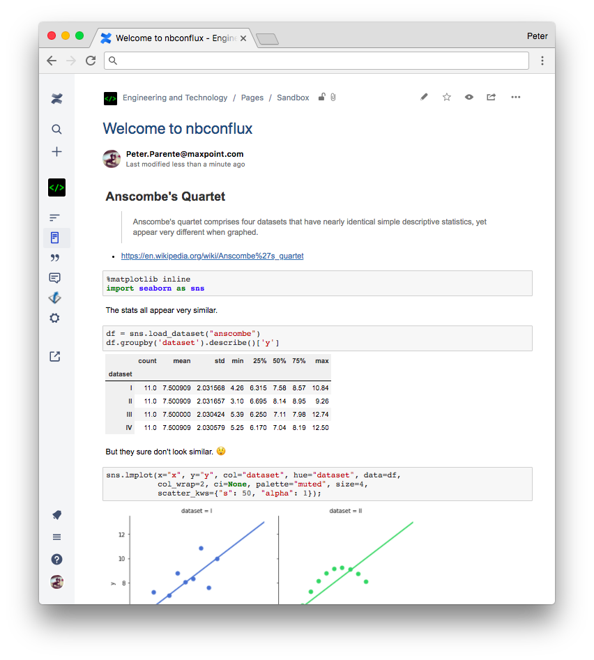

# nbconflux

nbconflux converts Jupyter Notebooks to [Atlassian Confluence](https://www.atlassian.com/software/confluence)
pages using
[nbconvert](https://github.com/jupyter/nbconvert).



## Why?

nbconflux is useful when:

* You use Jupyter notebooks to author computational narratives
* Your organization uses Confluence to store institutional knowledge
* You want an easy way to publish your work in that knowledge base

## Features

* Converts most cell inputs and outputs to valid [Confluence storage format](https://confluence.atlassian.com/doc/confluence-storage-format-790796544.html)
* Attaches image outputs (e.g., matplotlib PNGs) to a page, shows them inline,
  and maintains the page-image association in the version history
* Attaches the source notebook to a page, links to it from the page footer, and
  maintains the page-notebook association in the version history
* Supports sweep-select Confluence comments over most input and output content
* Excludes input, output, or entire cells based on notebook cell tags `noinput`,
  `nooutput`, or `nocell`
* Labels pages with `nbconflux` to identify content that originated as notebooks
* Inserts a table of contents macro at the top of the page based on notebook
  headings
* Applies the NBViewer stylesheet to pages to blend Confluence styling with
  Jupyter notebook styling (requires the CSS macro)
* Enables MathJax rendering (requires the [HTML macro](https://confluence.atlassian.com/doc/html-macro-38273085.html))
* Supports raw-cell passthrough of Confluence storage format markup (e.g., to
  include Confluence macros)
* Compatible with Confluence Cloud and Confluence Server

## Installation

The nbconflux library requires Python 3 to run and `pip` to install.
Once you've satisfied these prerequisites, run:

```bash
pip install nbconflux
```

(A conda package is coming soon.)


## Usage

1. Create or visit a page on your Confluence site.
2. Copy the URL for the page.
3. Run one of the following:
    * In a shell:
        ```bash
        nbconflux /path/to/a.ipynb https://your/page/url
        ```
    * In a Python script, Jupyter Notebook, etc.:
        ```python
        import nbconflux
        html, resources = nbconflux.notebook_to_page(nb_path, url)
        ```
4. Enter your Confluence username and password when prompted.
5. Visit the page to see your updates.

If you receive an error, see the project issues for known limitations on what
you can post.

Run `nbconflux -h` at the command line for additional options and help.

```
usage: nbconflux [-h] [--exclude-toc] [--exclude-ipynb] [--exclude-style]
                 [--include-mathjax]
                 notebook url

Converts Jupyter Notebooks to Atlassian Confluence pages using nbconvert

positional arguments:
  notebook           Path to local notebook (ipynb)
  url                URL of Confluence page to update

optional arguments:
  -h, --help         show this help message and exit
  --exclude-toc      Do not generate a table of contents
  --exclude-ipynb    Do not attach the notebook to the page
  --exclude-style    Do not include the Jupyter base stylesheet
  --include-mathjax  Enable MathJax on the page
  --extra-labels EXTRA_LABELS [EXTRA_LABELS ...]
                     Additional labels to add to the page

Collects credentials from the following locations:
1. CONFLUENCE_USERNAME and CONFLUENCE_PASSWORD environment variables
2. ~/.nbconflux file in the format username:password
3. User prompts
```

## Contributing

We welcome issues and pull requests that help improve the variety of notebook
content and Confluence installations nbconflux supports, its usability for
humans, and its reusability within other tools.

We recommend creating a Python development environment using `conda` or
`virtualenv`, running `make dev-env` to install the runtime and development
requirements, and running `make test` to execute the unit test suite on your
local machine.

## FAQ

Q: Why not call it nbconfluence?

A: https://atlassian.com/legal/trademark

Q: Why do I have to create a page on the site first?

A: To avoid introducing the complexity of specifying a space, parent page, and
   title into the package.

## License

Copyright (c) 2018 Valassis Digital under the terms of the BSD 3-Clause license

## Development

To run the tests:

```
make dev-env
make test
```

## Maintenance

To make a release:

1. Meet all the requirements described in
   https://dustingram.com/articles/2018/03/16/markdown-descriptions-on-pypi
   to support pushing the Markdown README as the long description on PyPI.
2. `git commit -m 'REL: 0.6.0' --allow-empty`
3. `git tag -a 0.6.0 -m 'REL: 0.6.0'`
4. `git push origin master` and `git push origin master --tags` or use a PR
5. Run `make release`.
6. Enter your PyPI creds when prompted.